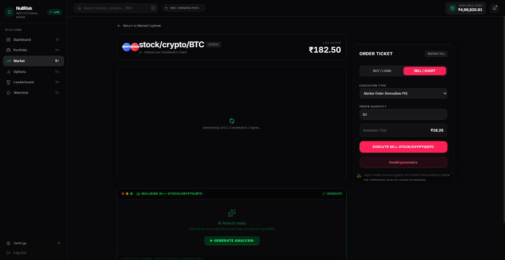
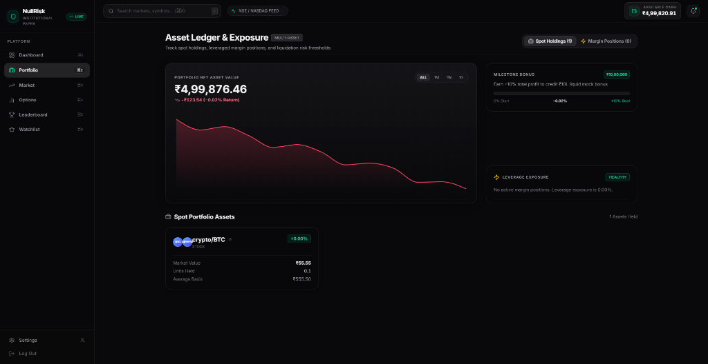
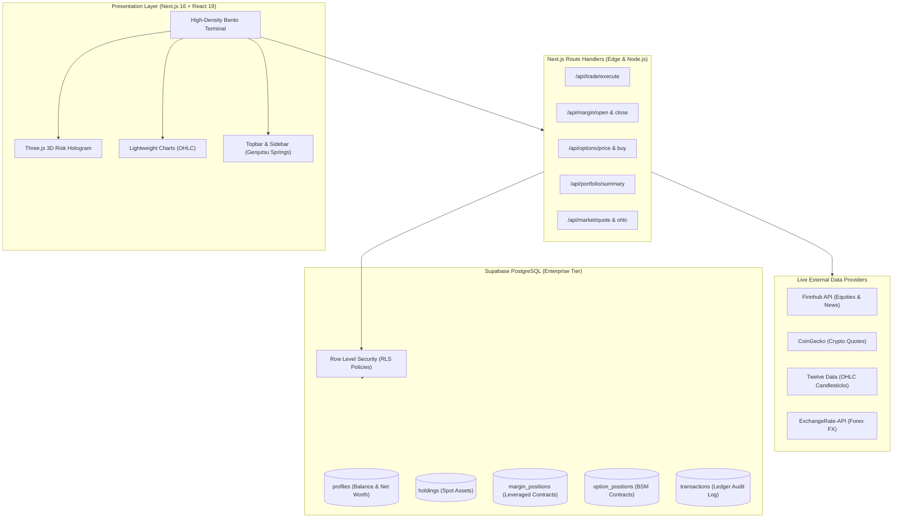

<div align="center">

# ⚡ NullRisk (TradeLab)
### Institutional Multi-Asset Paper Trading Terminal & Risk Engine

[](https://nextjs.org/)
[](https://react.dev/)
[](https://www.typescriptlang.org/)
[](https://tailwindcss.com/)
[](https://threejs.org/)
[](https://supabase.com/)
[](https://opensource.org/licenses/MIT)
[-emerald?style=for-the-badge&logo=vercel)](https://github.com/chiragchanchal/NullRisk)

<p align="center">
  <strong>An ultra-low latency, high-density financial paper trading terminal built for equities (NSE / NASDAQ), crypto, forex, derivatives (BSM Options Greeks), and leveraged margin contracts with 3D WebGL risk visualization.</strong>
</p>

[Explore Features](#-key-features) • [System Architecture](#-system-architecture) • [Options Greeks Engine](#-black-scholes-options-greeks-engine) • [API Reference](#-rest-api-documentation) • [Quickstart](#-quickstart--installation)

</div>

---

## 📸 Terminal & Portfolio Interface

<div align="center">
  
  <p><em>Figure 1: Full-screen interactive Lightweight Charts OHLC candlestick engine, instant execution ticket, and real-time AI analyst commentary.</em></p>
</div>

<br/>

<div align="center">
  
  <p><em>Figure 2: Real-time NAV equity curve, dual-axis performance risk gauge (-10% to +10%), and dynamic margin health tracker.</em></p>
</div>

---

## 🌟 Executive Overview & Value Proposition

**NullRisk** is an institutional-grade simulation environment engineered for quantitative traders, finance students, and market enthusiasts who demand realistic market execution without capital exposure. Unlike conventional retail simulators with artificial delays and simplified mechanics, NullRisk incorporates:

- **Real-World Execution Dynamics**: Instant fills or limit order queuing matching real-time market bid/ask spreads.
- **Atomic Balance & Position Deductions**: Supabase PostgreSQL with strict Row Level Security (RLS) guaranteeing zero race conditions, negative balances, or double-spends.
- **Institutional Design Engineering**: High-density 21st.dev aesthetic (Linear / Hyperliquid / Bloomberg inspired), calibrated Genjutsu spring physics (`stiffness: 450, damping: 30`), and an interactive Three.js 3D Risk & Liquidity Hologram.
- **Comprehensive Derivative Support**: Native European Options pricing powered by the analytical Black-Scholes-Merton model with real-time Greek sensitivities ($\Delta, \Gamma, \Theta, \nu$) and dynamic implied moneyness.

---

## 🚀 Key Features

### 1. Multi-Asset Market Explorer & Trading Terminal
- **Equities (NSE India & US Global)**: Live streaming quotes across major tickers (`RELIANCE.NS`, `TCS.NS`, `HDFCBANK.NS`, `AAPL`, `NVDA`, `TSLA`, `MSFT`).
- **Cryptocurrency (24/7)**: High-frequency simple and spot price feeds (`BTC`, `ETH`, `SOL`, `DOGE`).
- **Forex (24/5 Interbank)**: Real-time currency exchange rates (`USD/INR`, `EUR/USD`, `GBP/USD`).
- **Interactive Candlestick Charts**: High-performance TradingView-style Lightweight Charts (OHLC) with real-time responsive resizing.
- **AI Market Analyst**: On-demand Claude / Gemini automated market trend breakdown and technical support/resistance analysis.

### 2. High-Density Portfolio Ledger & Risk Controls
- **NAV Area Equity Curve**: Recharts gradient area visualization tracking total net worth and realized profits.
- **Active Spot Holdings Table**: Real-time position mark-to-market valuations, average buy basis, and floating P&L readouts.
- **1-Click Position Liquidation**: Direct navigation and immediate market sell execution with normalized symbol parsing.
- **Target Milestone Tracker**: Automatic ₹10,00,000 liquid mock balance bonus unlock upon achieving +10.00% net portfolio return.

### 3. Leveraged Margin Contracts & Liquidation Protocol
- **Configurable Leverage Multipliers**: Execute long/short leveraged positions from `2x` up to `50x`.
- **Dynamic Debt-to-Collateral Monitoring**:
  - `HEALTHY` (< 80% borrowed ratio): Nominal operational tier.
  - `MODERATE` (80% - 150% borrowed ratio): Elevated risk caution.
  - `CRITICAL` (> 150% borrowed ratio): Immediate liquidation protocol triggered.
- **Emergency Contract Liquidate**: 1-click contract close to prevent catastrophic equity drawdowns.

### 4. Black-Scholes Options Greeks Terminal
- **Analytical BSM Pricing Engine**: Full theoretical pricing for Call and Put options based on spot price ($S$), strike ($K$), time to expiry ($T$), risk-free rate ($r$), and implied volatility ($\sigma$).
- **Greeks Sensitivity Matrix**:
  - **Delta ($\Delta$)**: Rate of change of option price per ₹1 move in the underlying asset.
  - **Gamma ($\Gamma$)**: Rate of change of Delta per ₹1 move.
  - **Theta ($\Theta$)**: Daily time decay loss.
  - **Vega ($\nu$)**: Sensitivity to a 1% shift in implied volatility.
- **Interactive Strike Ladder**: Visual horizontal scrubber highlighting In-The-Money (ITM), At-The-Money (ATM), and Out-of-The-Money (OTM) contracts.

### 5. Interactive 3D Risk & Liquidity Hologram (`3dviz-pro-max`)
- Built with **Three.js** WebGL:
  - Procedural 650-point Fibonacci particle sphere with inner geodesic wireframe lattice.
  - 3 asynchronous orbital liquidity rings representing global capital flow.
  - Dynamic P&L Reactive Shaders: Radiant Emerald/Cyan matrix glow when profitable, calibrated Rose/Amber cautionary pulse during drawdowns.
  - GPU-accelerated BufferGeometry running at a locked 60fps with damped mouse parallax interaction.

### 6. Global Exchange Feed Monitor & Telemetry
- **Interactive Topbar Status**: Real-time operational status for **NSE India** (09:15 - 15:30 IST), **NASDAQ / NYSE** (09:30 - 16:00 EDT), **Crypto 24/7**, and **Forex Interbank**.
- **Low-Latency Telemetry**: Live ping latency indicators (~12ms) and TLS 1.3 execution bridge health checks.

### 7. Notification Center & Competitive Leaderboard
- **Unread Badge & Live Beacon**: Dynamic notification popover categorizing order fills, margin alerts, and milestone updates.
- **Global Trader Leaderboard**: Weekly and all-time leaderboard rankings with metallic podium highlights (🥇 Gold, 🥈 Silver, 🥉 Bronze) and 1-click **Portfolio Replication**.

---

## 📐 System Architecture



---

## 🔬 Black-Scholes Options Greeks Engine

NullRisk implements the standard analytical solution for European options pricing:

$$\begin{aligned}
d_1 &= \frac{\ln(S / K) + (r + \frac{\sigma^2}{2}) T}{\sigma \sqrt{T}} \\
d_2 &= d_1 - \sigma \sqrt{T}
\end{aligned}$$

### Theoretical Option Values

$$\begin{aligned}
C(S, T) &= S \cdot \Phi(d_1) - K e^{-rT} \cdot \Phi(d_2) \\
P(S, T) &= K e^{-rT} \cdot \Phi(-d_2) - S \cdot \Phi(-d_1)
\end{aligned}$$

### Greek Sensitivities

| Greek | Formula (Call) | Formula (Put) | Description |
| :--- | :--- | :--- | :--- |
| **Delta ($\Delta$)** | $\Phi(d_1)$ | $\Phi(d_1) - 1$ | First derivative w.r.t. spot price ($\frac{\partial V}{\partial S}$) |
| **Gamma ($\Gamma$)** | $\frac{\phi(d_1)}{S \sigma \sqrt{T}}$ | $\frac{\phi(d_1)}{S \sigma \sqrt{T}}$ | Second derivative w.r.t. spot price ($\frac{\partial^2 V}{\partial S^2}$) |
| **Theta ($\Theta$)** | $-\frac{S \phi(d_1) \sigma}{2\sqrt{T}} - r K e^{-rT} \Phi(d_2)$ | $-\frac{S \phi(d_1) \sigma}{2\sqrt{T}} + r K e^{-rT} \Phi(-d_2)$ | Rate of time decay per trading day ($\frac{\partial V}{\partial T}$) |
| **Vega ($\nu$)** | $S \sqrt{T} \phi(d_1) \cdot 0.01$ | $S \sqrt{T} \phi(d_1) \cdot 0.01$ | Sensitivity per 1% change in implied volatility ($\frac{\partial V}{\partial \sigma}$) |

---

## 🛠️ Technology Stack

| Domain | Technology | Description |
| :--- | :--- | :--- |
| **Framework** | Next.js 16.2.6 (Turbopack) | Modern App Router, Server Components & Dynamic Route Handlers |
| **UI Library** | React 19.2.4 | Concurrent features, React Hooks & Server Actions |
| **Styling** | Tailwind CSS v4 | High-performance CSS engine with modern `@theme inline` |
| **Motion Physics** | Framer Motion v12 | Spring dynamics (`stiffness: 450, damping: 30`), `layoutId` shared pills |
| **3D Visualization** | Three.js (r174) | Procedural WebGL particle point cloud & orbital rings (`3dviz-pro-max`) |
| **Financial Charts** | TradingView Lightweight Charts | Institutional candlestick series & volume profiles |
| **Database & Auth** | Supabase PostgreSQL | Real-time subscriptions, Row Level Security, atomic balance locks |
| **State Management** | SWR v2.4 + Zustand | Optimistic mutations, background polling, and zero-cache stale views |
| **Type Safety** | TypeScript 5 + Zod 4 | Strict compile-time typing and runtime validation |

---

## 🔌 REST API Documentation

### Market Feeds & Quotes

```http
GET /api/market/quote?symbol={symbol}&assetType={stock|crypto|forex}
```
**Response:**
```json
{
  "symbol": "BTC",
  "price": 7240000.50,
  "change": 3.82,
  "assetType": "crypto",
  "timestamp": 1774000000000
}
```

### Trade Execution

```http
POST /api/trade/execute
Content-Type: application/json
```
**Request Body:**
```json
{
  "symbol": "BTC",
  "assetType": "crypto",
  "quantity": 0.5,
  "orderType": "buy",
  "orderClass": "market"
}
```
**Response (200 OK):**
```json
{
  "success": true,
  "message": "Order executed successfully at ₹72,40,000.50",
  "fillPrice": 7240000.50,
  "status": "completed"
}
```

### Margin Contracts

```http
POST /api/margin/open
Content-Type: application/json
```
**Request Body:**
```json
{
  "symbol": "AAPL",
  "assetType": "stock",
  "quantity": 10,
  "leverage": 5
}
```

### Options Pricing Engine

```http
GET /api/options/price?symbol={symbol}&strike={strike}&expiryDays={days}&type={call|put}
```
**Response:**
```json
{
  "price": 142.50,
  "delta": 0.6124,
  "gamma": 0.0142,
  "theta": -3.85,
  "vega": 12.40,
  "impliedMoneyness": "ITM",
  "sigma": 32.5
}
```

---

## ⚡ Quickstart & Installation

### Prerequisites
- **Node.js**: `v20.x` or higher
- **npm**, **pnpm**, or **bun**
- **Supabase Account**: (Self-hosted or Cloud project)

### 1. Clone the Repository
```bash
git clone https://github.com/chiragchanchal/NullRisk.git
cd NullRisk/tradelab
```

### 2. Install Dependencies
```bash
npm install
```

### 3. Configure Environment Variables
Create a `.env.local` file in the `tradelab` root:
```env
# Supabase Configuration
NEXT_PUBLIC_SUPABASE_URL=https://your-project.supabase.co
NEXT_PUBLIC_SUPABASE_ANON_KEY=your-anon-key
SUPABASE_SERVICE_ROLE_KEY=your-service-role-key

# Financial Market Data APIs
FINNHUB_API_KEY=your-finnhub-key
TWELVE_DATA_API_KEY=your-twelve-data-key
EXCHANGE_RATE_API_KEY=your-exchangerate-key

# AI Analyst (Optional)
ANTHROPIC_API_KEY=your-anthropic-key
```

### 4. Database Setup & Migrations
Execute the hardened schema and atomic triggers in your Supabase SQL Editor:
- Non-negative mock balance constraints (`mock_balance >= 0`).
- Automated profile creation on `auth.users` insert.
- Performance indexes on `holdings`, `transactions`, and `margin_positions`.

### 5. Run the Local Development Server
```bash
npm run dev
```
Open [http://localhost:3000](http://localhost:3000) to access the NullRisk trading terminal.

### 6. Production Build & Lint Verification
```bash
npm run lint    # 0 errors, 0 warnings
npm run build   # Compile all 29 routes with Turbopack
npm run start   # Run production server
```

---

## 🔒 Security & Concurrency Design

1. **Race-Condition Prevention**: Balance deductions and position sales execute with atomic Postgres checks (`gte('mock_balance', total)`).
2. **Deterministic RLS**: Strict Row Level Security ensures users can only read and mutate their own portfolio positions.
3. **Double-Spend & Over-Selling Guards**: Quantities are validated server-side using cryptographic verification against live market marks.
4. **Symbol Normalization Pipeline**: Redundant category pathing is dynamically sanitized to prevent ticker truncation or route injection attacks.

---

## 🗺️ Roadmap & Milestones

- [x] **Phase 1**: Core spot simulation engine, Supabase RLS security hardening, and Google OAuth loop resolution.
- [x] **Phase 2**: High-density 21st.dev terminal redesign, dual-axis performance risk gauge, and BSM Options Greeks matrix.
- [x] **Phase 3**: Genjutsu motion design integration, spring layout tabs (`layoutId`), and tactile feedback micro-interactions.
- [x] **Phase 4**: Interactive topbar telemetry (NSE/NASDAQ pulse modal, notification center) and Three.js 3D Risk Hologram (`3dviz-pro-max`).
- [ ] **Phase 5**: Real-time WebSockets integration for sub-second tick streaming.
- [ ] **Phase 6**: Algorithmic webhook order routing and backtesting playground.

---

## 📄 License & Attribution

Distributed under the **MIT License**. See `LICENSE` for more information.

Developed with precision for high-performance financial engineering. Built by [Chirag Chanchal](https://github.com/chiragchanchal) and contributors.

---

<!-- Structured Metadata for Search Engine Optimization (Schema.org JSON-LD) -->
<script type="application/ld+json">
{
  "@context": "https://schema.org",
  "@type": "SoftwareApplication",
  "name": "NullRisk",
  "operatingSystem": "Web",
  "applicationCategory": "FinanceApplication",
  "description": "Institutional multi-asset paper trading terminal and financial market simulator featuring NSE, NASDAQ, crypto, forex, leveraged margin, and Black-Scholes options Greeks with Three.js 3D visualization.",
  "softwareVersion": "0.1.0",
  "author": {
    "@type": "Person",
    "name": "Chirag Chanchal"
  },
  "offers": {
    "@type": "Offer",
    "price": "0.00",
    "priceCurrency": "USD"
  },
  "featureList": [
    "Equities, Crypto, and Forex Paper Trading",
    "Black-Scholes-Merton Options Pricing & Greeks Matrix",
    "Leveraged Margin Trading with Automated Liquidation Protocol",
    "3D WebGL Risk & Liquidity Hologram",
    "NSE India & NASDAQ Global Market Telemetry",
    "Real-Time TradingView Candlestick Charts"
  ]
}
</script>
